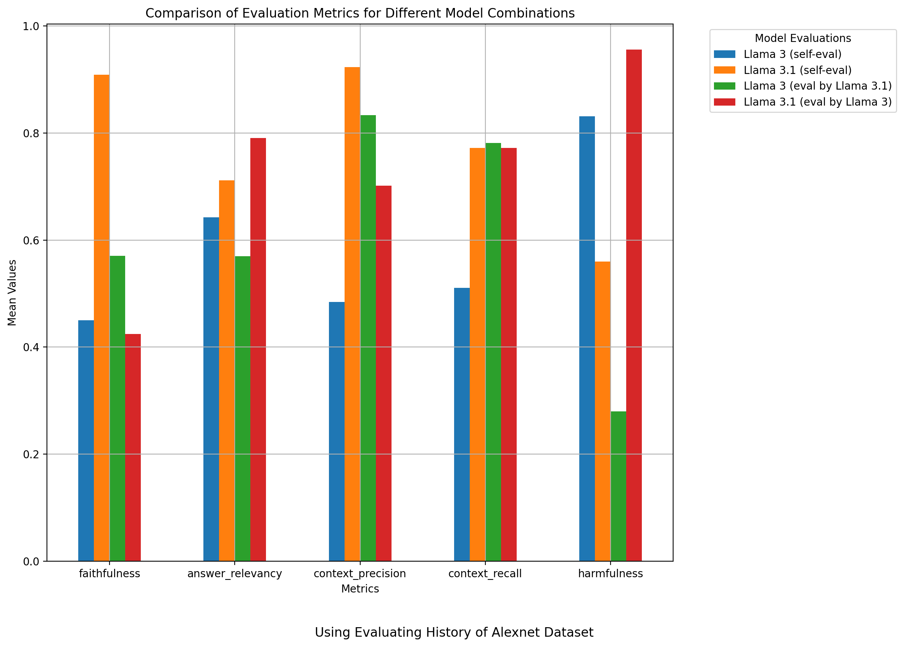
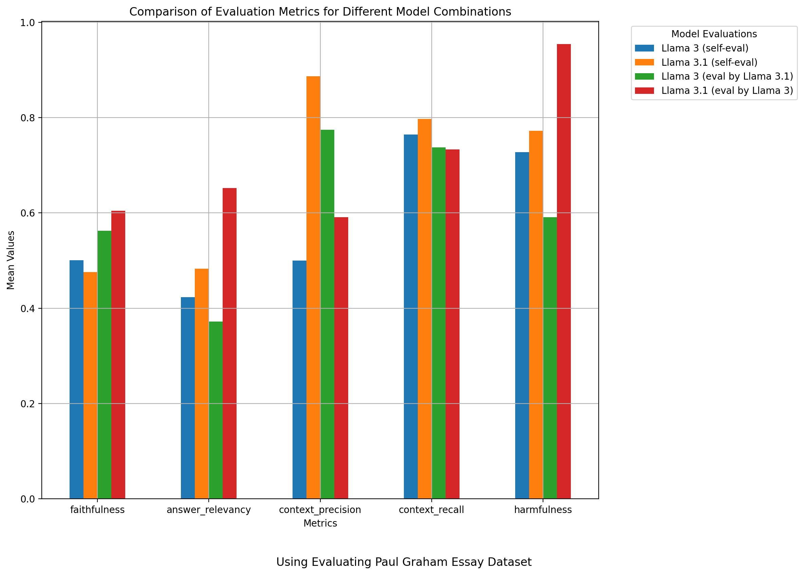
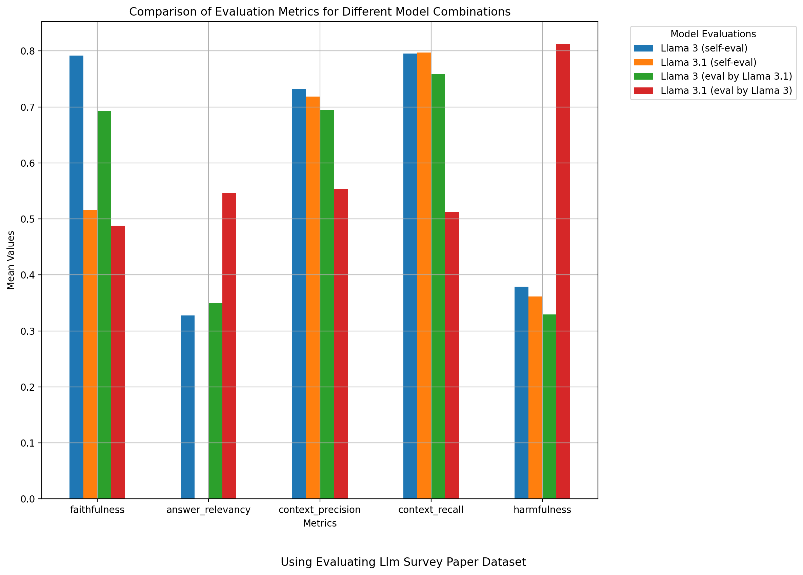
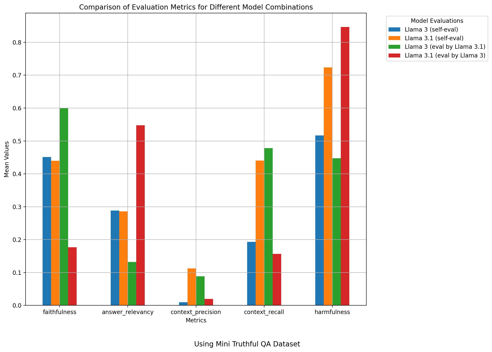

# Ragas Evaluation

This project evaluates the performance of a query engine using various metrics. It leverages the Ragas library and integrates with Llama Index and Ollama for embeddings and model inference.

## Prerequisites

Ensure you have the following installed:

- Python 3.x
- `ragas`
- `llama-index`
- `ollama`
- `datasets`
- `dotenv`

## Installation

1. Clone the repository:

   ```bash
   git clone https://github.com/anand-kamble/eval-comparison/
   ```

2. Install the required packages:

   ```bash
   pip install -r requirements.txt
   ```

3. Set up your environment variables using a `.env` file. If you are using OpenAI.

## Configuration

The script uses several models and datasets that need to be configured. Here are the key settings:

- **Models**: The default model used for both query and evaluation is `llama3`.
- **Dataset**: The default dataset is `HistoryOfAlexnetDataset`.
- **Embeddings**: Uses `OllamaEmbedding` with the `llama3` model.

## Usage

The script performs the following tasks:

1. **Embedding Setup**:
   - Configures `OllamaEmbedding` for use with the query model.
   
   ```python
   embeddings = OllamaEmbedding(model_name=QUERY_MODEL, base_url="http://class02:11434")
   Settings.embed_model = embeddings
   ```

2. **Document Loading**:
   - Loads documents from the specified dataset directory, supporting `.pdf` and `.txt` files.
   
   ```python
   documents = SimpleDirectoryReader(f"./data/{DATASET}", required_exts=[".pdf", ".txt"], recursive=True).load_data()
   ```

3. **Vector Index Building**:
   - Constructs a vector index from the loaded documents.
   
   ```python
   vector_index = VectorStoreIndex.from_documents(documents[:2])
   ```

4. **Query Engine Building**:
   - Initializes a query engine using the specified LLM model.
   
   ```python
   generator_llm = Ollama(model=QUERY_MODEL, request_timeout=600.0, base_url="http://class02:11434", additional_kwargs={"max_length": 512})
   query_engine = vector_index.as_query_engine(llm=generator_llm)
   ```

5. **Evaluation**:
   - Evaluates the query engine against specified metrics such as faithfulness, answer relevancy, context precision, context recall, and harmfulness.
   - Uses `Ollama` model for evaluation LLM.
   
   ```python
   evaluator_llm = Ollama(model=EVALUATION_MODEL, base_url="http://class01:11434", request_timeout=600.0)
   ```

6. **Test Set Preparation**:
   - Converts a JSON dataset into a `Dataset` object for evaluation.
   
   ```python
   llama_rag_dataset = None
   with open(f"data/{DATASET}/rag_dataset.json", "r") as f:
       llama_rag_dataset = json.load(f)

   testset = {
       "question": [],
       "ground_truth": [],
   }

   for item in llama_rag_dataset["examples"]:
       testset["question"].append(item["query"])
       testset["ground_truth"].append(item["reference_answer"])

   dataset = Dataset.from_dict(testset)
   ```

7. **Save Results**:
   - Saves the evaluation results to a CSV file and timing details to a text file.

## Running the Script

To run the evaluation, execute:

```bash
python ragas_evaluation.py
```

This will output the evaluation metrics and timing results in the `results` directory.

## Metrics

The following metrics are evaluated:

- **Faithfulness**: How accurately the answers reflect the source content.
- **Answer Relevancy**: How relevant the answers are to the given queries.
- **Context Precision**: How precisely the context is captured in the answers.
- **Context Recall**: How comprehensively the context is represented.
- **Harmfulness**: How potentially harmful the content of the answers is.

## Results

The results will be saved in CSV format with the filename pattern:

```
results/<DATASET>_query_<QUERY_MODEL>_eval_<EVALUATION_MODEL>.csv
```

Timing results will be saved in a text file:

```
results/<DATASET>_query_<QUERY_MODEL>_eval_<EVALUATION_MODEL>.txt
```

## Troubleshooting

- Ensure the dataset directory is correctly structured and contains the required files.
- Check that the base URLs for the Ollama models are accessible.
- Adjust `request_timeout` and `max_length` as needed for your environment.

# Results
## Comparison of Evaluation Metrics
### Evaluation on the History of Alexnet Dataset
The following plot shows the comparison of evaluation metrics using the History of Alexnet Dataset:


### Evaluation on the Paul Graham Essay Dataset
The following plot shows the comparison of evaluation metrics using the Paul Graham Essay Dataset:



### Evaluation on the Llm Survey Paper Dataset
The following plot shows the comparison of evaluation metrics using the Lim Survey Paper Dataset:


### Evaluation of the Mini Truthful QA Dataset



## Explanation of the Plots
- **Faithfulness**: Measures how accurately the generated answers reflect the source content.
- **Answer Relevancy**: Evaluates how relevant the answers are to the queries.
- **Context Precision**: Assesses how precisely the context is captured in the answers.
- **Context Recall**: Measures how comprehensively the context is represented.
- **Harmfulness**: Evaluates the potential harmfulness of the content.

### Each plot compares the metrics across different model combinations:

- **Llama 3 (self-eval)**: Self-evaluation using Llama 3.
- **Llama 3.1 (self-eval)**: Self-evaluation using Llama 3.1.
- **Llama 3 (eval by Llama 3.1)**: Evaluation of Llama 3 by Llama 3.1.
- **Llama 3.1 (eval by Llama 3)**: Evaluation of Llama 3.1 by Llama 3.